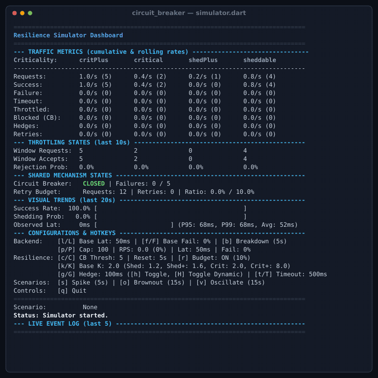

# Circuit Breaker & Resilience Patterns for Dart

A production-grade resilience engineering library for Dart backend services and Flutter applications. Implements battle-tested distributed systems patterns inspired by the Google SRE book and *The Tail at Scale*: circuit breaking, adaptive throttling, speculative request hedging, retry budgets with full jitter, deadline propagation, and criticality load shedding.



---

## Quick Positioning: Server vs. Client / Flutter

Resilience is not one-size-fits-all. A Flutter mobile application experiencing sporadic mobile connectivity with low request volume requires fundamentally different resilience strategies than a high-throughput Dart backend service coordinating hundreds of microservice RPCs per second.

### Architectural Matrix: When to Use What

| Pattern | High-Throughput Server RPCs | Flutter & Client Apps | Operational Rationale |
| :--- | :--- | :--- | :--- |
| **Circuit Breaker** | **Essential** | **Essential** | Fails fast to protect downstream services from cascading failure on the backend; prevents radio/battery drain and provides immediate offline/degraded UX on mobile. |
| **Exponential Retry + Jitter** | **Essential (with Budget)** | **Essential (Bounded)** | Smooths out transient hiccups. Backends **must** enforce a Retry Budget to prevent retry storms; clients benefit from full jitter to desynchronize retries. |
| **Adaptive Throttling** | **Essential** | **Not Recommended** | Relies on high QPS over a rolling time window to statistically compute backend rejection rates ($P_{\text{throttle}}$). Client traffic is too sparse and bursty for statistical accuracy. |
| **Criticality Shedding** | **Essential** | **Rarely Needed** | Backends shed batch and background traffic (`sheddable`) first to protect revenue-critical endpoints (`criticalPlus`). Client requests are almost always user-facing. |
| **Request Hedging** | **Dynamic (Adaptive)** | **Static (Fixed Delay)** | Backends run continuous stochastic percentile tracking (P95) with token buckets; clients lack continuous traffic to warm the tracker and should use a simple, deterministic static delay (e.g. 150ms). |
| **Deadline & Cancellation** | **Essential** | **Essential** | Servers propagate timeouts across multi-tier microservices to kill zombie requests; Flutter cancels downstream network calls when a widget is disposed or navigation pops. |
| **Hierarchical Resources** | **Recommended** | **Optional / Flat** | Models microservices, database clusters, and sub-endpoints with cascading parent-child health states and deadlock-free trial requests. |

---

## Progressive Adoption Model

The library is designed for progressive adoption across four layers, from a zero-setup one-liner to an enterprise service mesh topology.

### Level 1: Zero Boilerplate (Ad-hoc Functions)
For simple calls where you just need exponential backoff or speculative hedging without managing state or circuit breakers:

```dart
import 'package:circuit_breaker/circuit_breaker.dart';

// Automatic exponential backoff with full jitter and timeout
final user = await retry(
  () => httpClient.get('/users/42'),
  maxAttempts: 3,
  baseDelay: const Duration(milliseconds: 100),
  timeout: const Duration(seconds: 5),
);

// Speculative hedging for latency-critical reads (idempotent operations only)
final suggestions = await hedge(
  () => searchIndex(query),
  delay: const Duration(milliseconds: 150),
);
```

### Level 2: Standalone Primitives
Use individual patterns as isolated, stateful objects with zero framework overhead:

```dart
// Standalone Circuit Breaker
final cb = CircuitBreaker.standalone(
  config: CircuitBreakerConfig(consecutiveFailuresThreshold: 3),
);
final profile = await cb.execute(() => fetchProfile());

// Standalone Retry with budget tracking
final retrier = Retry.standalone(
  maxAttempts: 4,
  baseDelay: const Duration(milliseconds: 150),
);
final result = await retrier.execute(() => callExternalApi());

// Standalone Request Hedger for tail latency
final hedger = RequestHedger.standalone(
  delay: const Duration(milliseconds: 200),
);
final fastResult = await hedger.execute(() => readReplica());

// Function decorators (.wrap and .wrapUnary)
final resilientFetch = cb.wrap(fetchProfile);
final userFromId = cb.wrapUnary<User, String>((id) => fetchUserById(id));
```

### Level 3: Standalone Composite Policy (`ResiliencePolicy`)
Bundle Circuit Breaker, Retries, Throttling, Hedging, and Timeout into a single cohesive policy object without requiring a central context. Ideal for repository classes in Flutter or client SDKs:

```dart
final apiPolicy = ResiliencePolicy(
  circuitBreaker: CircuitBreakerConfig(consecutiveFailuresThreshold: 5),
  retry: RetryConfig(maxAttempts: 3),
  timeout: const Duration(seconds: 4),
);

// Execute directly
final data = await apiPolicy.execute(() => api.loadDashboard());

// Or wrap existing functions
final decoratedFetch = apiPolicy.wrap(api.loadDashboard);
```

### Level 4: Enterprise Service Context (`ResilienceContext`)
For server-side microservices, multi-tier architectures, shared resource states, and distributed deadline propagation:

```dart
final context = ResilienceContext();

// Bind and configure a resource with shared health metrics
final paymentService = context.resource(
  'payment-service',
  circuitBreaker: CircuitBreakerConfig(consecutiveFailuresThreshold: 5),
  retry: RetryConfig(maxAttempts: 3, retryBudgetRatio: 0.1),
  throttling: ThrottlingConfig(k: 2.0),
  timeout: const Duration(seconds: 5),
);

// Execute directly on the bound resource
final receipt = await paymentService.execute(() => processPayment());

// Fine-grained operations with overrides & criticality tiers
final backgroundSync = paymentService.operation(
  'backgroundSync',
  criticality: Criticality.sheddable,
  retryOverride: RetryConfig(maxAttempts: 1),
);
await context.execute(backgroundSync, () => syncTelemetry());
```

---

## Client & Flutter Guide

Mobile and client-side web applications have distinct operational constraints:
- Requests are sporadic and user-initiated (low QPS).
- Mobile radio power states mean repeatedly retrying against dead backends rapidly drains battery and wastes cellular bandwidth.
- Fast, deterministic UI feedback is critical when services are down or slow.

### Recommended Client Patterns
1. **Circuit Breakers**: Stop repeating requests to dead backends. Failing fast prevents UI freezes and avoids draining the device radio.
2. **Exponential Backoff with Full Jitter**: Randomizes retry delays (`_random * cappedDelay`) to prevent thousands of mobile apps from hitting a recovering API simultaneously.
3. **Static Hedging**: For search autocomplete or critical reads, dispatch a second speculative request after a fixed delay (e.g. 150–250ms) without waiting for a full 5-second timeout.
4. **Lifecycle Cancellation**: Bind `CancellationToken` to Flutter widget disposal to cancel in-flight HTTP requests when the user navigates away.

### Flutter Example: Search Autocomplete with Static Hedging & Cancellation
```dart
class SearchRepository {
  final _policy = ResiliencePolicy(
    circuitBreaker: CircuitBreakerConfig(
      consecutiveFailuresThreshold: 3,
      resetTimeout: const Duration(seconds: 10),
    ),
    retry: RetryConfig(maxAttempts: 2),
    hedging: HedgingConfig(
      enabled: true,
      delay: const Duration(milliseconds: 150), // Static delay for client
    ),
    timeout: const Duration(seconds: 3),
  );

  Future<List<String>> search(String query, {CancellationToken? token}) async {
    final effectiveToken = token ?? CancellationToken();
    return await ResilienceContext.runWithCancellationToken(
      effectiveToken,
      () => _policy.executeCancelable((cancelCompleter) async {
        return await api.fetchSuggestions(query, cancelToken: effectiveToken);
      }),
    );
  }
}
```

> [!TIP]
> **What to avoid in Flutter / Client apps**:
> - Avoid **Adaptive Throttling**: Because clients make relatively few requests, rolling-window rejection probabilities are statistically noisy and may shed legitimate user actions.
> - Avoid **Dynamic Hedging**: Stochastic percentile tracking requires steady traffic to learn latency percentiles. Use **Static Hedging** instead.

---

## Server-to-Server Distributed Resilience

For backend services, microservices, and API gateways under continuous load, the library implements advanced distributed systems patterns from Google SRE.

### Adaptive Throttling (Google SRE Book, Chapter 21)
When downstream services become overloaded, retries and incoming requests can trigger cascading failures. Adaptive throttling runs client-side to calculate a probabilistic rejection rate based on the ratio of accepted requests to total requests over a rolling window (default 2 minutes):

$$P_{\text{throttle}} = \max\left(0, \frac{\text{requests} - K \times \text{accepts}}{\text{requests} + 1}\right)$$

- **`requests`**: Total requests issued to the backend within the rolling window.
- **`accepts`**: Number of requests accepted (succeeded) by the backend.
- **`K` (Acceptance Multiplier)**: Controls aggressiveness. A value of `2.0` means the client allows twice as many requests as the backend accepts, tolerating up to a 50% failure rate before shedding traffic. Lower `K` makes throttling more aggressive.
- **`minRequests`**: If `requests < minRequests`, $P_{\text{throttle}} = 0.0$ to prevent throttling on startup or low traffic.

When throttled, requests fail fast locally with a `ThrottledException` before reaching the network.

### Criticality-Aware Load Shedding
Traffic is not created equal. Under overload, backend systems must sacrifice background or batch work to preserve interactive user journeys.

The library supports four criticality tiers:
1. `Criticality.criticalPlus`: High-priority traffic (e.g. checkout, login).
2. `Criticality.critical`: Default production traffic.
3. `Criticality.sheddablePlus`: Batch operations, speculative reads.
4. `Criticality.sheddable`: Telemetry, prefetching, offline sync.

The base multiplier `K` is automatically distributed across levels using the `spread` factor (default `1.0`):
- `criticalPlus`: $\max(1.1, K \times (1.0 + 3.0 \times \text{spread}))$
- `critical`: $\max(1.1, K)$
- `sheddablePlus`: $\max(1.1, K \times (1.0 - 0.2 \times \text{spread}))$
- `sheddable`: $\max(1.1, K \times (1.0 - 0.4 \times \text{spread}))$

With default settings ($K = 2.0, \text{spread} = 1.0$):
- `criticalPlus` ($K = 8.0$): Tolerates up to 87.5% failure before throttling.
- `critical` ($K = 2.0$): Tolerates up to 50% failure before throttling.
- `sheddablePlus` ($K = 1.6$): Starts shedding at 37.5% failure.
- `sheddable` ($K = 1.2$): Starts shedding at 16.7% failure.

Custom explicit values can also be provided via Dart Records:
```dart
final backend = Resource(
  'inventory-db',
  throttling: ThrottlingConfig.withCriticality(
    k: (
      criticalPlus: 10.0,
      critical: 2.0,
      sheddablePlus: 1.5,
      sheddable: 1.1,
    ),
  ),
);
```

### Retry Budgets (Preventing Retry Storms)
A traditional retry mechanism retries every failed request up to $N$ times. If a downstream service is struggling, this triples traffic ($3\times$ QPS) right when the service is most vulnerable—a catastrophic "retry storm".

A **Retry Budget** limits the proportion of requests in a rolling window (`budgetWindow`, default 1 minute) that can be retries:
$$\text{Allowed if: } (\text{retries} + 1) \le (\text{requests} + 1) \times \text{retryBudgetRatio}$$
- Default: `retryBudgetRatio: 0.1` (at most 10% of total traffic can be retries).
- Guarded by `minRequestsForBudget` (default 10) to avoid false rejections during cold start.
- If the budget is exhausted, further retries are suppressed and the failure is rethrown immediately.

### Dynamic (Adaptive) Request Hedging
Request hedging mitigates tail latency ("The Tail at Scale", Dean & Barroso) by speculatively launching a parallel secondary request if the primary request exceeds a latency threshold.

> [!IMPORTANT]
> Only use request hedging for **idempotent** operations (e.g. read RPCs). Hedging duplicates network requests!

Dynamic hedging eliminates manual delay tuning by continuously tracking runtime latency percentiles with three mathematical safeguards:

#### 1. Stochastic Percentile Tracking (Robbins-Monro Algorithm)
To eliminate memory overhead and GC pressure from storing rolling latency arrays, the library uses a stochastic approximation algorithm that converges in $O(1)$ space and time:
- Let $V$ be the raw percentile estimate, $P$ be `dynamicPercentile` (e.g. 0.95 for P95), and $R$ be `adaptationRate` (default 10.0, required $R > 1.0 - P$):
- If the request was **slow** ($> V$):
  $$V_{\text{new}} = V_{\text{old}} \times \left(1 + \frac{P}{R}\right)$$
- If the request was **fast** ($< V$):
  $$V_{\text{new}} = V_{\text{old}} \times \left(1 - \frac{1 - P}{R}\right)$$
- The actual hedging delay applied is $T_{\text{hedge}} = V \times \text{delayMultiplier}$ (clamped between `minDelay` and `maxDelay`).

#### 2. Retrospective Latency Tracking (Feedback Loop Elimination)
If a backend experiences a global slowdown, naive hedging only observes fast completions (survival bias), falsely lowering the hedging delay and triggering a self-inflicted DDoS.
- The library uses **Retrospective Tracking**: it evaluates $\min(\text{latency}_{\text{primary}}, \text{latency}_{\text{hedge}})$.
- When the backend slows down globally, both attempts are slow. The tracker observes this shift, increases $V$, and delays or reduces hedging.

#### 3. Early Registration & Token Bucket Overload Protection
- **Early Registration**: When a request begins, an internal timer fires at $V$. If the primary request is still running, it is immediately registered as "slow" *before* waiting for the request or hedge to complete, giving instantaneous reaction to latency spikes.
- **Hedging Token Bucket**: Refilled at rate $1.0 - \text{overloadPercentile}$ on every logical request (e.g., 0.05 tokens for P95). Starting a hedge consumes 1 token. When the bucket is empty, speculative hedges are blocked, mathematically capping maximum excess traffic to $1 - \text{overloadPercentile}$ (e.g., 5%).
- **Concurrency Cap**: `maxConcurrentHedges` limits simultaneous in-flight hedges per resource.

### Hierarchical Resources & Nested Topologies
Model complex architectures where fine-grained endpoints share backend infrastructure:
```dart
final databaseCluster = Resource('postgres-cluster');
final userEndpoint = Resource('users-api', parent: databaseCluster);
final orderEndpoint = Resource('orders-api', parent: databaseCluster);
```
- **Parent-to-Child Propagation**: If `postgres-cluster` circuit breaker trips to `OPEN`, all operations on `users-api` and `orders-api` fail fast immediately.
- **Selective Isolation**: If `users-api` trips its circuit breaker due to a buggy query, `orders-api` and `postgres-cluster` remain healthy.
- **Deadlock-Free Recovery**: When a parent is open, child requests act as trial requests once the parent's reset timeout expires.

### Deadline & Cancellation Propagation
Distributed requests often span multiple services ($A \to B \to C$). If $A$ times out or the caller disconnects, $B$ and $C$ must not waste CPU on abandoned "zombie requests".

Dart `Zone`s implicitly carry deadlines and cancellation signals across async execution chains:
```dart
// Propagate incoming HTTP headers (e.g., in Shelf or Dart Frog middleware)
final incomingDeadline = DateTime.parse(request.headers['X-Server-Deadline']!);
final clientToken = CancellationToken(); // attached to client socket close

await ResilienceContext.runWithDeadline(incomingDeadline, () {
  return ResilienceContext.runWithCancellationToken(clientToken, () async {
    // Child calls automatically inherit the deadline and cancellation token
    final result = await dbService.execute(() => db.query());
  });
});
```
- **Deadline Merging**: When nested deadlines are encountered, the earlier deadline always wins.
- **Cancellation**: Cancelling a parent `CancellationToken` immediately aborts all children with `OperationCancelledException`.

---

## Execution Pipeline Architecture

When combining Retry, Circuit Breakers, Hedging, and Adaptive Throttling, their relative ordering is vital to prevent conflicting behavior.

### Execution Order
The library orchestrates resilience patterns in the following strict order (outer wrapper to inner call):

```
Incoming Request
  │
  ▼
┌─────────────────────────────────────────────────────────────┐
│ 1. Circuit Breaker Gate                                     │ ──► [OPEN] Fail fast with CircuitBreakerOpenException
└──────────────────────────────┬──────────────────────────────┘
                               │ [CLOSED / Allowed Trial]
                               ▼
┌─────────────────────────────────────────────────────────────┐
│ 2. Adaptive Throttling Gate                                 │ ──► [THROTTLED] Proactively shed with ThrottledException
│    (Bypassed for CB Half-Open trial requests)               │
└──────────────────────────────┬──────────────────────────────┘
                               │ [Accepted]
                               ▼
┌─────────────────────────────────────────────────────────────┐
│ 3. Overall Timeout (Zone Deadline)                          │ ──► [DEADLINE] Abort with ResilienceTimeoutException
└──────────────────────────────┬──────────────────────────────┘
                               │
                               ▼
┌─────────────────────────────────────────────────────────────┐
│ 4. Retry Loop                                               │
│    • Checked against Retry Budget                           │
│    • Exponential Backoff + Full Jitter                      │
└──────────────────────────────┬──────────────────────────────┘
                               │ Logical Attempt
                               ▼
┌─────────────────────────────────────────────────────────────┐
│ 5. Request Hedging Loop                                     │
│    • Launches primary request                               │
│    • Dispatches speculative hedge after delay               │
│    • Bounded by Token Bucket & Concurrency Cap              │
│    • Early registration timer updates percentile tracker    │
└──────────────────────────────┬──────────────────────────────┘
                               │
                               ▼
                        [ Target Action ]
```

### Why Retry Wraps Hedging (Not Vice Versa)
- If Hedging wrapped Retry, starting a speculative hedge would launch a *second parallel retry loop*. During an outage, this would cause exponential traffic multiplication.
- By placing Retry on the outside, a hedged attempt is treated as part of a single logical attempt. If either the primary or hedged request succeeds, the logical attempt succeeds. A retry is only triggered if *both* primary and hedged calls fail.

### Metric Isolation
- **Throttling & Circuit Breakers** record metrics at the *logical attempt* level. If a primary request times out but its hedge succeeds, the operation is recorded as a success.
- **Retry Budgets** only count retries triggered by the outer retry loop. Speculative hedges do not consume retry budget permits.
- **Circuit Breaker fast-fails** and **Adaptive Throttling drops** do not record failures into each other's metrics.

---

## Failure Classification

By default, the library distinguishes system failures from application-level client errors:
- **Ignored (Not System Failures)**:
  - Programmer errors: `ArgumentError`, `RangeError`, `FormatException`, `TypeError`, `AssertionError`.
  - Control-flow exceptions: `CircuitBreakerOpenException`, `ThrottledException`, `OperationCancelledException`.
  - These never trip the circuit breaker or inflate throttling failure counts.
- **Counted as System Failures**:
  - All other unhandled exceptions (e.g. `SocketException`, `HttpException`, timeouts).

You can supply a custom `failureClassifier` to customize this (e.g., treating HTTP 4xx as client errors and 5xx as system failures):
```dart
final config = ResourceConfig(
  failureClassifier: (error) {
    if (error is HttpException) {
      // 4xx errors are client mistakes, not downstream system failures
      return error.statusCode >= 500;
    }
    return true;
  },
);
```

---

## Interactive Terminal Simulator

The package includes an interactive full-screen terminal dashboard to simulate and observe resilience patterns in real-time under load spikes, latency brownouts, and service breakdowns.

```bash
dart run example/simulator.dart
```

See [example/README.md](example/README.md) for full interactive controls, hotkeys, and scenario playbooks.

---

## References

*   **Google SRE Book - Handling Overload**: [Chapter 21](https://sre.google/sre-book/handling-overload)
*   **Google SRE Book - Addressing Cascading Failures**: [Chapter 22](https://sre.google/sre-book/addressing-cascading-failures)
*   **The Tail at Scale**: [Jeffrey Dean and Luiz André Barroso (CACM)](https://cacm.acm.org/magazines/2013/2/160173-the-tail-at-scale/fulltext)
*   **Circuit Breaker Pattern**: [Martin Fowler](https://martinfowler.com/bliki/CircuitBreaker.html)
*   **Exponential Backoff and Jitter**: [AWS Architecture Blog](https://aws.amazon.com/blogs/architecture/exponential-backoff-and-jitter/)

## Disclaimer

This is not an officially supported Google product.
